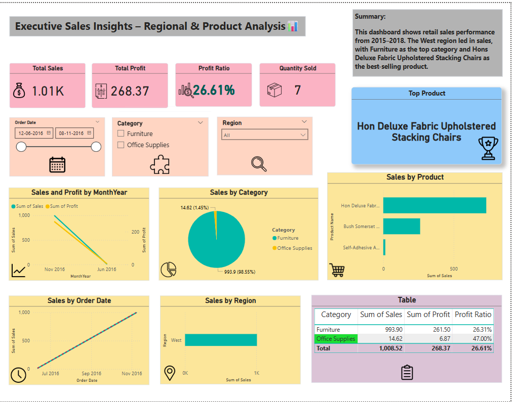

# Power BI Sales Dashboard 📊

## Executive Sales Insights – Regional & Product Analysis

This project analyzes retail sales data using Power BI to uncover key insights such as:

- 💰 **Total Sales** and **Profit Trends**
- 📍 **Regional Performance** (West leading)
- 🪑 **Top Product**: Hon Deluxe Fabric Upholstered Stacking Chairs
- 📦 Category Breakdown (Furniture & Office Supplies)

### 📌 Tools & Skills Used:
- Power BI (DAX, Visual Design)
- Data Cleaning & Modeling
- KPI & Interactive Slicer Visuals

### 📷 Dashboard Preview:

---
